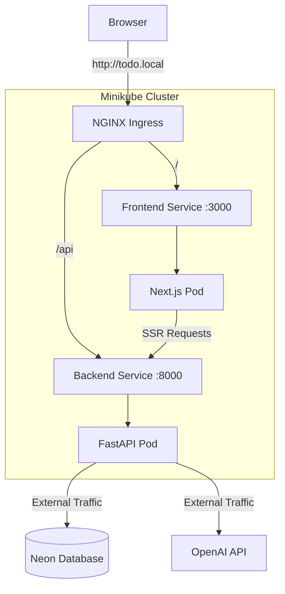

# Data Model & Architecture: Phase 4

**Feature**: Phase 4 Local Kubernetes Deployment

## Component Architecture

## Helm Chart Values Schema (`values.yaml`)

### Global
| Key | Type | Default | Description |
|-----|------|---------|-------------|
| `global.domain` | string | `todo.local` | The base domain for ingress |

### Backend
| Key | Type | Default | Description |
|-----|------|---------|-------------|
| `backend.replicaCount` | int | `1` | Number of pods |
| `backend.image.repository` | string | `todo-backend` | Image name |
| `backend.image.tag` | string | `latest` | Image tag |
| `backend.service.port` | int | `8000` | Service port |
| `backend.resources` | object | `{}` | CPU/Memory limits |

### Frontend
| Key | Type | Default | Description |
|-----|------|---------|-------------|
| `frontend.replicaCount` | int | `1` | Number of pods |
| `frontend.image.repository` | string | `todo-frontend` | Image name |
| `frontend.image.tag` | string | `latest` | Image tag |
| `frontend.service.port` | int | `3000` | Service port |
| `frontend.env.internalBackendUrl` | string | `http://todo-app-backend:8000` | K8s DNS for SSR |

### Secrets (To be injected)
| Key | Description |
|-----|-------------|
| `DATABASE_URL` | Connection string for Neon DB |
| `OPENAI_API_KEY` | Key for AI features |
| `BETTER_AUTH_SECRET` | Shared secret for auth |
